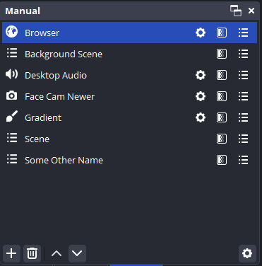

<!-- Title -->
# OBS Quick Access Utility

    <i align="center"> Moo-ve over, cluttered docks. No more bull. Making your sources udderly easy to cow-nect with.</i>

<h4 align="center">
    
    
    
    
     
    
    
</h4>

> **Note**
> While we only release new versions of QAU after testing it on local hardware, there are bugs and issues that will slip through. If you happen to run into any issues, please [open an issue](https://github.com/finitesingularity/obs-quick-access-utility/issues) and we will work to resolve it.

## Introduction

Quick Access Utility (QAU) is the cream of the crop for OBS plugins, letting you manage and edit your sources without having to change scenes or udderly disrupting your workflow. With features like hotkeys, transform changes, and filter access all in easy-to-use docks, it's the perfect way to keep everything smooth as butter!

- 🐮 QAU provides three different [dock types](#docks): [Manual](#manual-dock), [Dynamic](#dynamic-dock), and [Search](#search-dock).
- 🧑‍🌾 It also enables a hotkey [quick search pop-up](#quick-search), giving you access to all of your sources at a key-stroke.
- 🥛 Docked sources have [fast-access options](#quick-access-buttons) for source properties, filters, and a list of all parent scenes.
- 🚜 All sources also have a [context menu](#context-menu) with commonly used tools such as rename, add to scene, and even integration with third party plugins like source clone.

## Docks
The primary feature of QAU are source docks, giving you quick and easy access to all of your sources. Three different docks are available: [Manual](#manual-dock), [Dynamic](#dynamic-dock), and [Search](#search-dock). To create a QAU dock, simply go to your `Tools` menu, select `Quick Access Utility`, and in the pop-up window, click `New Dock`. Next, give the dock a name, select the type of dock you want, and select which quick access buttons you want: properties, filters, and parent scenes. If you want to switch scenes when a scene is clicked in your dock, check the "Clickable Scenes" option.

Note that all created docks can be turned off or on from the OBS `Docks` menu.

### Manual Dock
Manual docks allow you to add any sources, scenes, or groups that you need quick access to. After creating a manual dock, click the `+` button in the lower left corner to select the sources, scenes, or groups you wish to include. You can then  use the up and down arrows to change the order of items in your dock, or the trash can to remove them. The cog button will allow you to change the quick access buttons and other options for your dock.

### Dynamic Dock
Dynamic docks have all of the same functionality/options of a manual dock, but are generated on the fly as you change scenes. A dynamic dock will show you all sources, including those in nested scenes that are being displayed from the current scene.

### Search Dock
A search dock does exactly what you would think- giving you a search input to find a particular needle in the haystack of sources in your OBS. As you type characters in the search field, the search dock will match on source name, type, file path, URL, and filters.

## Quick Search
Quick Search provides a search pop-up that can be summoned and dismissed using a user-defined hotkey. As you interact with the pop-up, it works exactly like a search dock, but quickly gets out of the way when you are done using it. To use the Quick Search feature, you need to set up a hotkey. Go to `File -> Settings`, then select `Hotkeys`.  Find the `Opens Quick Search` field, and assign a hotkey. I find that `Ctrl + Space` works great.

## Tools
QAU provides a suite of tools that allow you to interact with, edit, and use the sources in a dock. These tools are accessed via quick access buttons directly in the dock, and through a right-click context menu.

### Quick Access Buttons
- **Properties**: opens the source's properties window. Not available for scene or group items.
- **Filters**: opens the filters window for a source, scene, or group.
- **Parent Scenes**: shows a list of all scenes that contain the selected item. Also provides a button to hide/show the item in each parent scene, and a button to open the transformation window for that item in each parent scene.
- **Clickable Scenes**: changes the current OBS scene to a scene clicked in a QAU dock. This lets you build different clickable scene docks, for example a list of only your output scenes when live streaming.

### Context Menu
- **Add to current scene**: Adds the item to the currently active scene.
- **Add clone to current scene**: Adds a clone of the item to the currently active scene. *note: requires the [source clone](https://obsproject.com/forum/resources/source-clone.1632/) plugin from Exeldro. If not installed, this option will not appear in your context menus.*
- **Properties**: opens the source's properties window. Is not in context menu for scene or group items.
- **Filters**: opens the filters window for a source, scene, or group.
- **Rename**: Renames the source globally.
- **Interact**: *For browser sources only*, opens an interactive browser window.
- **Refresh**: *For browser sources only*, reloads the browser source.
- **Activate/Deactivate**: *For video capture devices only*, toggles the activated status of the source.
- **Open Windowed Projector**: Opens a windowed projector.
- **Fullscreen Projector**: Opens a fullscreen projector.

